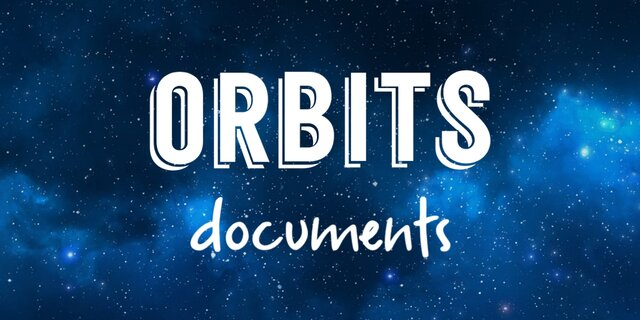

# ORBITS Documents

    

 

## **About**  
Tempat cadangan dokumen dan informasi penting.

## 📂 **Data**  

- [**Members List**](./data/20241205-members-list.md) (05/12/2024)  
  Rincian daftar anggota ORBITS.
- [**Panduan Penggunaan**](./data/20241205-panduan-penggunaan.md) (05/12/2024)  Shortcut/Cheatsheet penulisan Markdown.

## 📂 **Schedule**
1. [Orbits Misteri (ORMIS)](./schedule/01-Orbits-Misteri.md) (KING & ᴼʳ★Aricha)
2. [FASH!ON UP2DATE](./schedule/02-FASH!ON-UP2DATE.md) (ᴼʳ★Luna & ᴼʳ★Flya)
3. [Kelaz Ghibah](./schedule/03-Kelaz-Ghibah.md) (*disamarkan*)
4. [Gamer Kalong](./schedule/04-Gamer-Kalong.md) (ᴼʳ★Ludfi & KING)
5. [Arisan Ibuk-Ibuk](./schedule/05-Arisan-Ibuk-Ibuk.md) (ᴼʳ★Sea & ᴼʳ★IcyFrost)

[**Lihat Selengkapnya**](./schedule.md)

## 📂 **Article**
- [1001 Trik Jitu PDKT Cwo](./article/draft.md)
- [Kode Keras Cwe untuk Cwo](./article/draft.md)

## 📂 **Backup**

- [**News**](./backup/20241206-1317-NEWS.md) (06/12/2024)  
  Arsip postingan di halaman News.
- [**Homepage**](./backup/20241205-1317-INDEX.md) (05/12/2024)  
  Konten website di halaman Beranda.
- [**README.md**](./backup/20241205-1317-README.md) (05/12/2024)  
  Ringkasan informasi mengenai ORBITS.

## **Contributor**

## **Thanks to**
**ᴼʳ★Moa**, **ᴼʳ★Luna**, **KING**, **ᴼʳ★Sea**, **ᴼʳ★Aricha**, **Syifaa**, dan **ᴼʳ★Zen**  
atas kerja keras mereka.

---
For inquiries, email [creworbits@gmail.com](mailto:creworbits@gmail.com).  
Report issues on [GitHub](https://github.com/orbits-1317/docs/issues).
